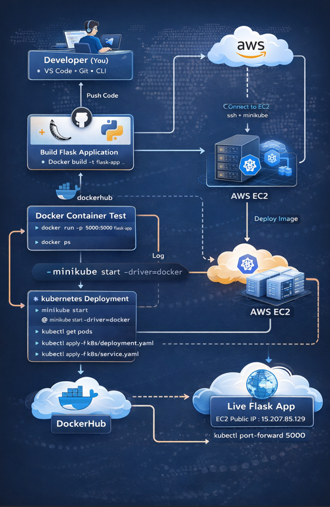

📄 README.md (FULL – Copy Paste)
# 🚀 Flask App Deployment using Docker, Kubernetes, CI/CD & AWS

## 📌 Project Overview

This project demonstrates a complete **end-to-end DevOps workflow** by deploying a Flask application using:

- 🐳 Docker (Containerization)
- ☸️ Kubernetes - Minikube (Orchestration)
- ☁️ AWS EC2 (Cloud Deployment)
- 🔁 GitHub Actions (CI/CD)

The goal is to simulate a **real-world production pipeline** from development to cloud deployment.

---

## 🧩 Architecture Workflow



### 🔄 Flow Explanation

1. Develop Flask app using Python
2. Build Docker image
3. Push code to GitHub
4. Deploy using Kubernetes
5. Run on AWS EC2 instance
6. Access application via public IP

---

## 📁 Project Structure


FLASK-K8S-CICD-AWS-DEVOPS/
│
├── .github/ # CI/CD workflows
├── app/
│ ├── app.py # Flask application
│ └── requirements.txt # Dependencies
│
├── architecture/
│ └── workflow.png # Architecture diagram
│
├── k8s/
│ ├── deployment.yaml # Kubernetes Deployment
│ └── service.yaml # Kubernetes Service
│
├── screenshots/ # Proof of execution
│ ├── docker-build-k8s.png
│ ├── dockerhub-k8s.png
│ ├── ec2-instance-created.png
│ ├── k8-running-ec2.png
│ ├── k8s-live.png
│ ├── live-aws.png
│ ├── minikube-ec2-running.png
│ ├── project-structure.png
│ └── wslconfig.png
│
├── Dockerfile
├── .dockerignore
└── README.md


---

## 🧑‍💻 Flask Application

```python
from flask import Flask

app = Flask(__name__)

@app.route('/')
def home():
    return "Flask App Running on Kubernetes 🚀"

if __name__ == '__main__':
    app.run(host='0.0.0.0', port=5000)
🐳 Docker Setup
📄 Dockerfile
FROM python:3.9-slim

WORKDIR /app

COPY app/requirements.txt .
RUN pip install -r requirements.txt

COPY app/ .

CMD ["python", "app.py"]
🔨 Build Docker Image
docker build -t flask-app .
▶️ Run Container
docker run -p 5000:5000 flask-app
📸 Screenshot

☸️ Kubernetes Setup (Minikube)
▶️ Start Minikube
minikube start --driver=docker
📄 deployment.yaml
apiVersion: apps/v1
kind: Deployment
metadata:
  name: flask-app
spec:
  replicas: 2
  selector:
    matchLabels:
      app: flask
  template:
    metadata:
      labels:
        app: flask
    spec:
      containers:
      - name: flask-container
        image: flask-app
        ports:
        - containerPort: 5000
📄 service.yaml
apiVersion: v1
kind: Service
metadata:
  name: flask-service
spec:
  type: NodePort
  selector:
    app: flask
  ports:
    - port: 5000
      targetPort: 5000
      nodePort: 30007
🚀 Deploy to Kubernetes
kubectl apply -f k8s/deployment.yaml
kubectl apply -f k8s/service.yaml
📊 Check Status
kubectl get pods
kubectl get svc
🌐 Access Application
minikube service flask-service
📸 Screenshots


☁️ AWS EC2 Deployment
🖥️ Launch Instance
OS: Ubuntu
Type: t2.micro (Free Tier)
Open Ports:
22 (SSH)
80 (HTTP)
30007 (App Port)
🔐 Connect to EC2
ssh -i key.pem ubuntu@<your-public-ip>
⚙️ Install Dependencies
sudo apt update
sudo apt install docker.io -y
sudo usermod -aG docker $USER
newgrp docker

sudo snap install kubectl --classic

curl -LO https://storage.googleapis.com/minikube/releases/latest/minikube-linux-amd64
sudo install minikube-linux-amd64 /usr/local/bin/minikube
▶️ Start Minikube on EC2
minikube start --driver=docker
📦 Deploy Application
git clone <your-repo>
cd flask-k8s-cicd-aws-devops

kubectl apply -f k8s/deployment.yaml
kubectl apply -f k8s/service.yaml
🌍 Access Application
http://<EC2-PUBLIC-IP>:30007
📸 Screenshots


🔁 CI/CD Pipeline (GitHub Actions)

This project includes a CI/CD pipeline that:

Builds Docker image
Pushes image to DockerHub
Automates deployment process
📸 Screenshot

📊 Key Features
✔ Containerized Flask Application
✔ Kubernetes Deployment with Scaling
✔ AWS Cloud Hosting
✔ CI/CD Automation
✔ Real-world DevOps Workflow
💰 Cost Optimization
Use AWS Free Tier (t2.micro)
Stop EC2 instance when not in use
Set billing alerts in AWS
🧠 Learnings
Docker image lifecycle
Kubernetes architecture (Pods, Services)
Cloud deployment using AWS EC2
CI/CD automation with GitHub Actions
📌 Future Improvements
Use AWS EKS (Managed Kubernetes)
Add LoadBalancer Service
Implement Monitoring (Prometheus + Grafana)
Add Helm Charts
🙌 Author

Tanavi Shinde